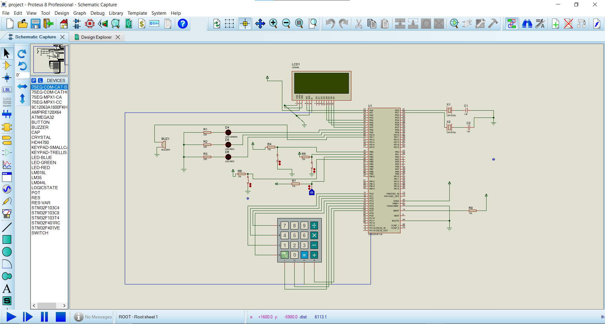

# RFID-Based Security System 🔐

This project is a password-protected security system using an STM32 microcontroller and an RFID module. It verifies user access through a 4x4 keypad and provides feedback via LEDs and an LCD screen.

---

## 📷 Preview

## 🚀 Features

- Password-based authentication system
- User interface with 16x2 LCD display
- Visual status indication using red and green LEDs
- Error feedback with blinking LEDs and buzzer
- RFID module (MFRC522) for potential expansion
- Implemented in **C language** using STM32CubeIDE
- Simulated in **Proteus**

---

## ⚙️ How It Works

1. On power-up, the system prompts the user to enter a password on the keypad.
2. The LCD displays real-time feedback while typing the password.
3. If the password is **correct**:
   - The red LED turns **off**, and the green LED turns **on**.
   - LCD shows a success message (e.g., "Access Granted").
4. If the password is **incorrect**:
   - Both red LEDs **blink** rapidly.
   - LCD displays an error message (e.g., "Incorrect Password").
5. The system resets and waits for another attempt.

---

## 🧩 Components Used

| Component               | Model / Type              | Notes                       |
|------------------------|---------------------------|-----------------------------|
| Microcontroller        | STM32F103C8 / STM32F401VE | Cortex-M3 ARM STM32 chip    |
| LCD Display            | 16x2 HD44780              | Parallel or I2C             |
| Keypad                 | 4x4 Matrix KEYPAD          |                            |
| RFID Module            | MFRC522                    | SPI connection              |
| PIR Sensor             | Generic PIR Sensor         | Motion detection (optional) |
| Buzzer                 | BUZZER                     | Audible alert               |
| Relay Module           | RELAY-SPDT                 | For door lock control       |
| LEDs                   | RED, GREEN, BLUE           | With 220Ω resistors         |
| Crystal Oscillator     | 8 MHz                      | With 2x 22pF capacitors     |
| Resistors              | 10kΩ, 220Ω                 | Pull-ups and LEDs           |
| Power Supply           | +5V, +3.3V                 | STM32: 3.3V, others: 5V     |
| Ground                 | GND                        | Common ground               |

---

## 🔌 Pin Configuration (STM32)

### LCD (HD44780 - Parallel Mode)
- RS: PB0  
- EN: PB1  
- D4~D7: PB4 ~ PB7  

### Keypad 4x4
- Rows (Outputs): PA8 ~ PA11  
- Columns (Inputs with 10kΩ pull-up): PA12, PA15, PB3, PB4

### RFID (MFRC522 via SPI)
- SDA: PA4  
- SCK: PA5  
- MISO: PA6  
- MOSI: PA7  
- RST: PA3

### LEDs
- Red: PC13  
- Green: PC14  
- Blue: PC15  

### Others
- PIR: PA0  
- Buzzer: PB0  
- Relay: PB1

---

## 💡 Simulation

Simulated using **Proteus** with the following setups:

- Clock Frequency: 72MHz
- External Crystal: 8MHz
- LCD: 16x2, HD44780
- Use `.hex` file generated from STM32CubeIDE
- Optional use of **Virtual Terminal** and **Logic Analyzer** for debugging

---

## 📁 Project Files

- `main.c`: Core logic of the system
- `main.h`: Header file definitions
- `stm32f1xx_hal_conf.h`: HAL configuration
- `*.hex`: Compiled firmware for Proteus
- `.pdsprj`: Proteus simulation project

---

## 📝 Final Notes

- Make sure pull-up resistors are connected properly for keypad inputs.
- Ensure correct power is supplied: 3.3V for STM32, 5V for LCD, PIR, Relay.
- Use debug tools in Proteus (e.g., Virtual Terminal) to test inputs and outputs.
- Customize the password logic inside `main.c` as needed.

---

## 📷 Preview

> *(You can add a photo or screenshot of your project or simulation circuit here for better presentation.)*

---

## 🔒 Project Goal

The aim of this project is to implement a simple yet effective **security system** that can be used to control access using a password and give real-time feedback through a user-friendly interface.

---

## 🧠 Future Enhancements

- Add EEPROM to store authorized passwords/cards
- Integrate RFID-based login
- Include motion detection with PIR sensor for alarms
- Add mobile notification system via GSM/WiFi

---

## 📜 License

This project is open-source and free to use under the MIT License.

